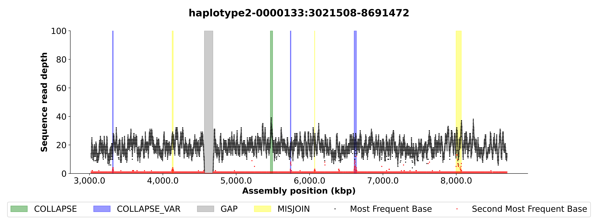

# `NucFlag`
[](https://github.com/logsdon-lab/NucFlag/actions/workflows/main.yml)
[](https://pypi.org/project/nucflag/)

Fork of [`NucFreq`](https://github.com/mrvollger/NucFreq). Script for making nucleotide frequency plots and marking misassemblies.



## Usage
```bash
pip install nucflag
```

```
usage: nucflag [-h] -i INPUT_BAM [-b INPUT_REGIONS] [-d OUTPUT_PLOT_DIR] [-o OUTPUT_MISASM] [-s OUTPUT_STATUS] [-r [REGIONS ...]] [-t THREADS] [-p PROCESSES] [-c CONFIG]
               [--ignore_regions IGNORE_REGIONS]

Use per-base read coverage to classify/plot misassemblies.

options:
  -h, --help            show this help message and exit
  -i INPUT_BAM, --input_bam INPUT_BAM
                        Input bam file. Must be indexed. (default: None)
  -b INPUT_REGIONS, --input_regions INPUT_REGIONS
                        Bed file with regions to check. (default: None)
  -d OUTPUT_PLOT_DIR, --output_plot_dir OUTPUT_PLOT_DIR
                        Output plot dir. (default: None)
  -o OUTPUT_MISASM, --output_misasm OUTPUT_MISASM
                        Output bed file with misassembled regions. (default: <_io.TextIOWrapper name='<stdout>' mode='w' encoding='utf-8'>)
  -s OUTPUT_STATUS, --output_status OUTPUT_STATUS
                        Bed file with status of contigs. With format: contig start end misassembled|good (default: None)
  -r [REGIONS ...], --regions [REGIONS ...]
                        Regions with the format: (.+):(\d+)-(\d+) (default: None)
  -t THREADS, --threads THREADS
                        Threads for reading bam file. (default: 4)
  -p PROCESSES, --processes PROCESSES
                        Processes for classifying/plotting. (default: 4)
  -c CONFIG, --config CONFIG
                        Additional threshold/params as toml file. (default: {'first': {'thr_min_peak_horizontal_distance': 10000, 'thr_min_peak_width': 20,
                        'thr_min_valley_horizontal_distance': 10000, 'thr_min_valley_width': 10, 'thr_peak_height_std_above': 3.2, 'thr_valley_height_std_below': 3}, 'second':
                        {'thr_min_perc_first': 0.2, 'thr_peak_height_std_above': 3, 'group_distance': 30000, 'thr_min_group_size': 10, 'thr_collapse_het_ratio': 0.2}})
  --ignore_regions IGNORE_REGIONS
                        Bed file with regions to ignore. With format: contig|all start end absolute|relative (default: None)
```

### Configuration
Configuration can be provided in the form of a `toml` file.

```bash
nucflag -i test/HG00096_hifi_test.bam -b test/test.bed -c config.toml
```

```toml
[first]
# Min horizontal distance between peaks.
thr_min_peak_horizontal_distance = 1
# Min width of peak to consider.
thr_min_peak_width = 20
# Min horizontal distance between valleys.
thr_min_valley_horizontal_distance = 1
# Min width of valley to consider.
thr_min_valley_width = 10
# Number of std above mean to include peak.
thr_peak_height_std_above = 4
# Number of std below mean to include valley.
thr_valley_height_std_below = 3
# Group consecutive positions allowing a maximum gap of x.
# Larger value groups more positions.
valley_group_distance = 500
peak_group_distance = 500

[second]
# Percent threshold of most freq base to allow second most freq base
# 10 * 0.1 = 1 so above 1 is allowed.
thr_min_perc_first = 0.1
# Number of std above mean to include peak.
thr_peak_height_std_above = 3
# Group consecutive positions allowing a maximum gap of x.
# Larger value groups more positions.
group_distance = 30_000
# Min group size.
thr_min_group_size = 5
# Het ratio to consider second group a collapse if no overlaps in peaks found.
thr_collapse_het_ratio = 0.1

[gaps]
# Allow gaps up to this length.
thr_max_allowed_gap_size = 1000
```

## Build
To build from source.
```bash
git clone git@github.com:logsdon-lab/NucFlag.git && cd NucFlag
make venv && make build && make install
```

## Test
Test BAM filtered from merged alignment of:
* PacBio HiFi reads from HGSVC sample `HG00096`.
  * https://ftp.1000genomes.ebi.ac.uk/vol1/ftp/data_collections/HGSVC3/working/20220831_JAX_HiFi/HG00096/
* Verkko v1.4.1 combined assembly for HGSVC sample `HG00096`
  * https://ftp.1000genomes.ebi.ac.uk/vol1/ftp/data_collections/HGSVC3/working/20240201_verkko_batch3/assemblies/HG00096/

To run tests:
```bash
source venv/bin/activate
make test
```

Or try the test example directly.
```bash
nucflag -i test/HG00096_hifi_test.bam -b test/test.bed -c test/config.toml
```
```
haplotype2-0000133:3021508-8691473      3314093 3324276 MISJOIN
haplotype2-0000133:3021508-8691473      4126277 4142368 COLLAPSE_VAR
haplotype2-0000133:3021508-8691473      4566798 4683011 GAP
haplotype2-0000133:3021508-8691473      5737835 5747246 MISJOIN
haplotype2-0000133:3021508-8691473      6067838 6072601 COLLAPSE_VAR
haplotype2-0000133:3021508-8691473      6607947 6639102 MISJOIN
haplotype2-0000133:3021508-8691473      7997560 8069465 COLLAPSE_VAR
```

Test workflow using `data/` dir.
```bash
snakemake \
-s test/workflow/Snakefile \
-j 12 \
--executor cluster-generic \
--cluster-generic-submit-cmd "bsub -q epistasis_normal -n {threads} -o /dev/null" \
--use-conda -p
```

## Cite
- **Vollger MR**, Dishuck PC, Sorensen M, Welch AE, Dang V, Dougherty ML, et al. Long-read sequence and assembly of segmental duplications. Nat Methods. 2019;16: 88–94. doi:10.1038/s41592-018-0236-3
- **Mc Cartney AM**, Shafin K, Alonge M, Bzikadze AV, Formenti G, Fungtammasan A, et al. Chasing perfection: validation and polishing strategies for telomere-to-telomere genome assemblies. bioRxiv. 2021. p. 2021.07.02.450803. doi:10.1101/2021.07.02.450803
  * Citing `hetDetection.R`

## TODO
- Add false duplication detection.
- Colormap for `Misassembly`
